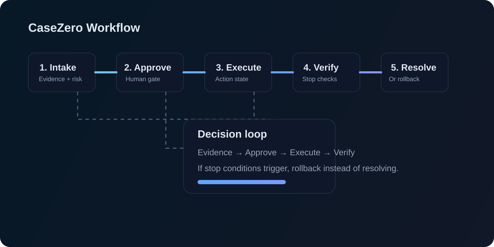

# CaseZero MVP

CaseZero is a portfolio-ready workflow simulator for AI-assisted incident response and operational decision-making. It models evidence collection, approval gates, automated verification, and rollback logic across realistic production scenarios.

## Portfolio summary

This project demonstrates how an operational control plane can turn evidence into safe decisions. It combines a polished UI with a deterministic state machine that covers certificate expiry, production incidents, database saturation, duplicate billing, access remediation, and pipeline reliability issues.

## How it works

Each scenario follows a repeatable workflow:

1. Intake evidence
   - The app loads the case, its risk severity, and the recommended action.
2. Human approval gate
   - The user reviews the proposal before the action can proceed.
3. Action execution
   - The workflow enters its execution state and performs the bounded operational change.
4. Verification
   - Stop conditions are checked to ensure the remediation remains safe.
5. Resolution or rollback
   - A successful verification leads to a clean resolution; failures trigger rollback instead of partial success.

This creates a compact demonstration of controlled automation, operational safety, and traceable decisions.

## Demo flow



## Why it matters

This project is useful for showcasing:

- AI-assisted operational reasoning
- human-in-the-loop approval patterns
- safe execution design with rollback protection
- structured evidence-driven decision making

## Local development

```bash
nvm use 22
npm install
npm run dev
```

Validate the project with:

```bash
npm run check
```

## Project structure

- `app/` — UI and simulation logic
- `.github/workflows/ci.yml` — GitHub Actions checks for lint, tests, and build
- `Makefile` — local automation helpers
- `start.sh`, `stop.sh`, `restart.sh` — clean restart commands

## License

This project is licensed under the MIT License. See the `LICENSE` file for details.
