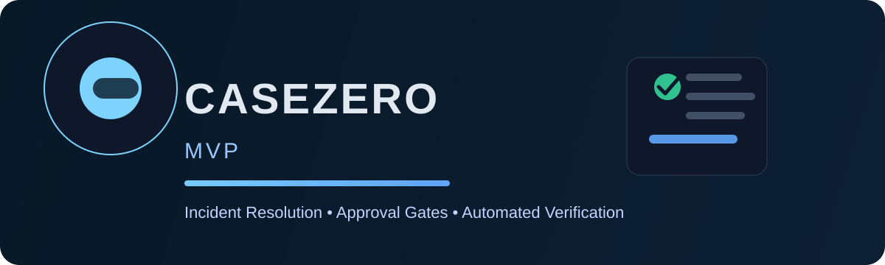

# CaseZero MVP

CaseZero is a portfolio-ready workflow simulator for AI-assisted incident response and operational decision-making. It demonstrates how a system can structure evidence, enforce human approval gates, and automatically verify whether a proposed action is safe before it is marked resolved.

## Portfolio-ready summary

This project combines a product-style UX with deterministic operational logic to model real-world remediations for certificate risk, production incidents, database saturation, access issues, customer refunds, and pipeline reliability failures. It highlights structured reasoning, approval workflows, and rollback protection in a single, easy-to-run demo.

## How it works

Each scenario follows the same evidence-to-resolution loop:

1. Case intake
   - The app loads a real-world operational case with evidence, risk severity, and a recommended action.
   - The user reviews the diagnosis, the recommended action, and the bounded impact of the change.

2. Human approval gate
   - The decision step models an approval checkpoint before any mutation is allowed.
   - Approval records a decision in the audit log; rejection preserves a safe no-action state.

3. Execution and verification
   - If approved, the app moves into the execution stage and runs the action state machine.
   - A verification phase checks safety conditions, stop conditions, and whether the intended outcome was achieved.

4. Safe resolution or rollback
   - The workflow resolves cleanly when the verification passes.
   - If a stop condition fires, the system triggers a rollback path instead of leaving the environment in a partially applied state.

This makes the system feel like a lightweight operation control plane rather than a generic app shell.

## Demo flow

1. Open the dashboard and select a scenario such as certificate expiry or duplicate billing.
2. Review the evidence timeline and recommended bounded action.
3. Inspect stop conditions to confirm the blast radius is controlled.
4. Approve the action and watch the state move through execution and verification.
5. See the final audit trail and either a safe resolution or rollback outcome.

The experience is intentionally compact, but the underlying logic demonstrates how high-confidence operational workflows can be modeled in code.

## Included in this project

- Six simulated incident and remediation scenarios
- Approval, rejection, and rollback state transitions
- Verification gating and stop-condition enforcement
- Audit-friendly workflow records
- A clean UI and deterministic simulation engine

## Local development

```bash
nvm use 22
npm install
npm run dev
```

Run the project checks with:

```bash
npm run check
```

## Project structure

- `app/` — UI and simulation logic
- `casezero-mvp/` — full project workspace used for the active app
- `.github/workflows/ci.yml` — GitHub Actions validation pipeline
- `Makefile` — local automation shortcuts
- `start.sh`, `stop.sh`, `restart.sh` — one-command workflow management

## License

This project is licensed under the MIT License. See the `LICENSE` file for details.
